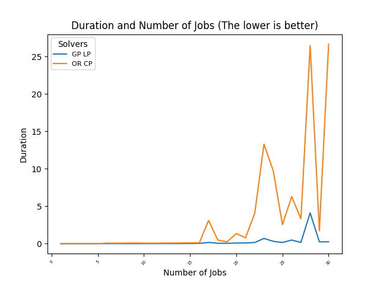
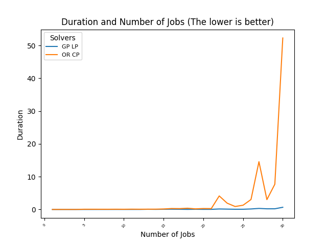

### Set Job

```
RANDOM SET, but each job has same attribute for each number condition

Gurobipy_LPsolver vs ORtools_CPsolver

Executed each process until 30 numbers of jobs,
and Time is recorded by each number Condition 
```

ORtools_LPsolver is ignored because of its slow performance.

---

# Experiment ( 1 / 2 )

## Random Job Set and Result
```
J1 --> Processing Time : 4 / Due Date : 2
Gurobi Passed : 2.0 Duration : 0.0007243156433105469 sec
ORtools CP Passed : 2.0 Duration : 0.0060405731201171875 sec

J1 --> Processing Time : 4 / Due Date : 2
J2 --> Processing Time : 5 / Due Date : 4
Gurobi Passed : 7.0 Duration : 0.0003566741943359375 sec
ORtools CP Passed : 7.0 Duration : 0.015054702758789062 sec

J1 --> Processing Time : 1 / Due Date : 3
J2 --> Processing Time : 9 / Due Date : 7
J3 --> Processing Time : 6 / Due Date : 2
Gurobi Passed : 14.0 Duration : 0.0007059574127197266 sec
ORtools CP Passed : 14.0 Duration : 0.013113737106323242 sec

J1 --> Processing Time : 8 / Due Date : 2
J2 --> Processing Time : 5 / Due Date : 6
J3 --> Processing Time : 6 / Due Date : 7
J4 --> Processing Time : 1 / Due Date : 1
Gurobi Passed : 23.0 Duration : 0.0024042129516601562 sec
ORtools CP Passed : 23.0 Duration : 0.012866497039794922 sec

J1 --> Processing Time : 8 / Due Date : 1
J2 --> Processing Time : 7 / Due Date : 7
J3 --> Processing Time : 6 / Due Date : 10
J4 --> Processing Time : 2 / Due Date : 15
J5 --> Processing Time : 9 / Due Date : 14
Gurobi Passed : 43.0 Duration : 0.004259586334228516 sec
ORtools CP Passed : 43.0 Duration : 0.011171579360961914 sec

J1 --> Processing Time : 2 / Due Date : 2
J2 --> Processing Time : 1 / Due Date : 4
J3 --> Processing Time : 9 / Due Date : 6
J4 --> Processing Time : 1 / Due Date : 6
J5 --> Processing Time : 5 / Due Date : 9
J6 --> Processing Time : 7 / Due Date : 8
Gurobi Passed : 27.0 Duration : 0.00540471076965332 sec
ORtools CP Passed : 27.0 Duration : 0.07191276550292969 sec

J1 --> Processing Time : 8 / Due Date : 1
J2 --> Processing Time : 3 / Due Date : 4
J3 --> Processing Time : 5 / Due Date : 9
J4 --> Processing Time : 5 / Due Date : 15
J5 --> Processing Time : 7 / Due Date : 19
J6 --> Processing Time : 2 / Due Date : 21
J7 --> Processing Time : 6 / Due Date : 15
Gurobi Passed : 48.0 Duration : 0.01042032241821289 sec
ORtools CP Passed : 48.0 Duration : 0.06608414649963379 sec

J1 --> Processing Time : 4 / Due Date : 2
J2 --> Processing Time : 4 / Due Date : 5
J3 --> Processing Time : 5 / Due Date : 6
J4 --> Processing Time : 2 / Due Date : 2
J5 --> Processing Time : 9 / Due Date : 7
J6 --> Processing Time : 8 / Due Date : 22
J7 --> Processing Time : 1 / Due Date : 5
J8 --> Processing Time : 1 / Due Date : 10
Gurobi Passed : 53.0 Duration : 0.005589962005615234 sec
ORtools CP Passed : 53.0 Duration : 0.07360577583312988 sec

J1 --> Processing Time : 4 / Due Date : 2
J2 --> Processing Time : 2 / Due Date : 4
J3 --> Processing Time : 2 / Due Date : 7
J4 --> Processing Time : 7 / Due Date : 3
J5 --> Processing Time : 4 / Due Date : 13
J6 --> Processing Time : 2 / Due Date : 23
J7 --> Processing Time : 3 / Due Date : 5
J8 --> Processing Time : 7 / Due Date : 14
J9 --> Processing Time : 8 / Due Date : 26
Gurobi Passed : 61.0 Duration : 0.008676290512084961 sec
ORtools CP Passed : 61.0 Duration : 0.08319616317749023 sec

J1 --> Processing Time : 7 / Due Date : 1
J2 --> Processing Time : 1 / Due Date : 2
J3 --> Processing Time : 5 / Due Date : 1
J4 --> Processing Time : 7 / Due Date : 1
J5 --> Processing Time : 7 / Due Date : 15
J6 --> Processing Time : 5 / Due Date : 9
J7 --> Processing Time : 3 / Due Date : 23
J8 --> Processing Time : 8 / Due Date : 31
J9 --> Processing Time : 9 / Due Date : 35
J10 --> Processing Time : 7 / Due Date : 10
Gurobi Passed : 146.0 Duration : 0.009306907653808594 sec
ORtools CP Passed : 146.0 Duration : 0.06831765174865723 sec

J1 --> Processing Time : 6 / Due Date : 1
J2 --> Processing Time : 2 / Due Date : 4
J3 --> Processing Time : 2 / Due Date : 1
J4 --> Processing Time : 5 / Due Date : 8
J5 --> Processing Time : 2 / Due Date : 12
J6 --> Processing Time : 8 / Due Date : 12
J7 --> Processing Time : 1 / Due Date : 22
J8 --> Processing Time : 9 / Due Date : 16
J9 --> Processing Time : 8 / Due Date : 34
J10 --> Processing Time : 5 / Due Date : 3
J11 --> Processing Time : 4 / Due Date : 28
Gurobi Passed : 105.0 Duration : 0.00924539566040039 sec
ORtools CP Passed : 105.0 Duration : 0.06438803672790527 sec

J1 --> Processing Time : 9 / Due Date : 2
J2 --> Processing Time : 6 / Due Date : 1
J3 --> Processing Time : 6 / Due Date : 6
J4 --> Processing Time : 6 / Due Date : 8
J5 --> Processing Time : 7 / Due Date : 12
J6 --> Processing Time : 9 / Due Date : 16
J7 --> Processing Time : 2 / Due Date : 14
J8 --> Processing Time : 4 / Due Date : 28
J9 --> Processing Time : 2 / Due Date : 26
J10 --> Processing Time : 3 / Due Date : 11
J11 --> Processing Time : 3 / Due Date : 14
J12 --> Processing Time : 2 / Due Date : 18
Gurobi Passed : 167.0 Duration : 0.014621973037719727 sec
ORtools CP Passed : 167.0 Duration : 0.0789344310760498 sec

J1 --> Processing Time : 6 / Due Date : 2
J2 --> Processing Time : 5 / Due Date : 6
J3 --> Processing Time : 2 / Due Date : 4
J4 --> Processing Time : 2 / Due Date : 11
J5 --> Processing Time : 9 / Due Date : 2
J6 --> Processing Time : 5 / Due Date : 11
J7 --> Processing Time : 2 / Due Date : 17
J8 --> Processing Time : 8 / Due Date : 9
J9 --> Processing Time : 8 / Due Date : 23
J10 --> Processing Time : 7 / Due Date : 12
J11 --> Processing Time : 8 / Due Date : 5
J12 --> Processing Time : 1 / Due Date : 14
J13 --> Processing Time : 7 / Due Date : 24
Gurobi Passed : 247.0 Duration : 0.014136314392089844 sec
ORtools CP Passed : 247.0 Duration : 0.0790705680847168 sec

J1 --> Processing Time : 2 / Due Date : 3
J2 --> Processing Time : 8 / Due Date : 3
J3 --> Processing Time : 8 / Due Date : 10
J4 --> Processing Time : 4 / Due Date : 7
J5 --> Processing Time : 8 / Due Date : 12
J6 --> Processing Time : 9 / Due Date : 4
J7 --> Processing Time : 5 / Due Date : 13
J8 --> Processing Time : 4 / Due Date : 10
J9 --> Processing Time : 9 / Due Date : 20
J10 --> Processing Time : 4 / Due Date : 19
J11 --> Processing Time : 2 / Due Date : 3
J12 --> Processing Time : 9 / Due Date : 26
J13 --> Processing Time : 2 / Due Date : 41
J14 --> Processing Time : 7 / Due Date : 6
Gurobi Passed : 309.0 Duration : 0.017617225646972656 sec
ORtools CP Passed : 309.0 Duration : 0.09201884269714355 sec

J1 --> Processing Time : 5 / Due Date : 1
J2 --> Processing Time : 7 / Due Date : 2
J3 --> Processing Time : 7 / Due Date : 3
J4 --> Processing Time : 1 / Due Date : 11
J5 --> Processing Time : 9 / Due Date : 10
J6 --> Processing Time : 9 / Due Date : 7
J7 --> Processing Time : 6 / Due Date : 22
J8 --> Processing Time : 1 / Due Date : 1
J9 --> Processing Time : 2 / Due Date : 28
J10 --> Processing Time : 5 / Due Date : 13
J11 --> Processing Time : 6 / Due Date : 5
J12 --> Processing Time : 6 / Due Date : 5
J13 --> Processing Time : 3 / Due Date : 41
J14 --> Processing Time : 5 / Due Date : 18
J15 --> Processing Time : 6 / Due Date : 41
Gurobi Passed : 307.0 Duration : 0.02902674674987793 sec
ORtools CP Passed : 307.0 Duration : 0.10957121849060059 sec

J1 --> Processing Time : 5 / Due Date : 1
J2 --> Processing Time : 3 / Due Date : 2
J3 --> Processing Time : 3 / Due Date : 1
J4 --> Processing Time : 9 / Due Date : 14
J5 --> Processing Time : 1 / Due Date : 16
J6 --> Processing Time : 6 / Due Date : 17
J7 --> Processing Time : 8 / Due Date : 21
J8 --> Processing Time : 2 / Due Date : 15
J9 --> Processing Time : 1 / Due Date : 22
J10 --> Processing Time : 6 / Due Date : 11
J11 --> Processing Time : 3 / Due Date : 32
J12 --> Processing Time : 8 / Due Date : 30
J13 --> Processing Time : 6 / Due Date : 23
J14 --> Processing Time : 2 / Due Date : 24
J15 --> Processing Time : 4 / Due Date : 30
J16 --> Processing Time : 6 / Due Date : 27
Gurobi Passed : 211.0 Duration : 0.04333329200744629 sec
ORtools CP Passed : 211.0 Duration : 0.11080503463745117 sec

J1 --> Processing Time : 1 / Due Date : 2
J2 --> Processing Time : 3 / Due Date : 2
J3 --> Processing Time : 1 / Due Date : 3
J4 --> Processing Time : 8 / Due Date : 6
J5 --> Processing Time : 1 / Due Date : 15
J6 --> Processing Time : 6 / Due Date : 8
J7 --> Processing Time : 4 / Due Date : 21
J8 --> Processing Time : 8 / Due Date : 11
J9 --> Processing Time : 4 / Due Date : 18
J10 --> Processing Time : 1 / Due Date : 33
J11 --> Processing Time : 2 / Due Date : 25
J12 --> Processing Time : 6 / Due Date : 16
J13 --> Processing Time : 5 / Due Date : 48
J14 --> Processing Time : 4 / Due Date : 44
J15 --> Processing Time : 4 / Due Date : 45
J16 --> Processing Time : 8 / Due Date : 53
J17 --> Processing Time : 5 / Due Date : 8
Gurobi Passed : 160.0 Duration : 0.1622025966644287 sec
ORtools CP Passed : 160.0 Duration : 3.1136488914489746 sec

J1 --> Processing Time : 7 / Due Date : 1
J2 --> Processing Time : 3 / Due Date : 3
J3 --> Processing Time : 2 / Due Date : 1
J4 --> Processing Time : 6 / Due Date : 12
J5 --> Processing Time : 9 / Due Date : 3
J6 --> Processing Time : 9 / Due Date : 22
J7 --> Processing Time : 8 / Due Date : 21
J8 --> Processing Time : 3 / Due Date : 31
J9 --> Processing Time : 8 / Due Date : 27
J10 --> Processing Time : 1 / Due Date : 4
J11 --> Processing Time : 3 / Due Date : 21
J12 --> Processing Time : 4 / Due Date : 24
J13 --> Processing Time : 4 / Due Date : 3
J14 --> Processing Time : 8 / Due Date : 37
J15 --> Processing Time : 2 / Due Date : 55
J16 --> Processing Time : 2 / Due Date : 59
J17 --> Processing Time : 6 / Due Date : 28
J18 --> Processing Time : 5 / Due Date : 58
Gurobi Passed : 298.0 Duration : 0.06094694137573242 sec
ORtools CP Passed : 298.0 Duration : 0.48381567001342773 sec

J1 --> Processing Time : 3 / Due Date : 2
J2 --> Processing Time : 2 / Due Date : 5
J3 --> Processing Time : 8 / Due Date : 3
J4 --> Processing Time : 8 / Due Date : 2
J5 --> Processing Time : 1 / Due Date : 6
J6 --> Processing Time : 9 / Due Date : 7
J7 --> Processing Time : 7 / Due Date : 14
J8 --> Processing Time : 1 / Due Date : 6
J9 --> Processing Time : 6 / Due Date : 18
J10 --> Processing Time : 3 / Due Date : 32
J11 --> Processing Time : 4 / Due Date : 5
J12 --> Processing Time : 1 / Due Date : 45
J13 --> Processing Time : 9 / Due Date : 31
J14 --> Processing Time : 8 / Due Date : 19
J15 --> Processing Time : 8 / Due Date : 51
J16 --> Processing Time : 3 / Due Date : 37
J17 --> Processing Time : 9 / Due Date : 21
J18 --> Processing Time : 9 / Due Date : 40
J19 --> Processing Time : 4 / Due Date : 75
Gurobi Passed : 400.0 Duration : 0.05287671089172363 sec
ORtools CP Passed : 400.0 Duration : 0.25766706466674805 sec

J1 --> Processing Time : 1 / Due Date : 1
J2 --> Processing Time : 3 / Due Date : 1
J3 --> Processing Time : 2 / Due Date : 5
J4 --> Processing Time : 3 / Due Date : 7
J5 --> Processing Time : 9 / Due Date : 7
J6 --> Processing Time : 3 / Due Date : 23
J7 --> Processing Time : 6 / Due Date : 22
J8 --> Processing Time : 6 / Due Date : 18
J9 --> Processing Time : 8 / Due Date : 8
J10 --> Processing Time : 8 / Due Date : 31
J11 --> Processing Time : 2 / Due Date : 35
J12 --> Processing Time : 5 / Due Date : 28
J13 --> Processing Time : 5 / Due Date : 44
J14 --> Processing Time : 7 / Due Date : 53
J15 --> Processing Time : 6 / Due Date : 16
J16 --> Processing Time : 1 / Due Date : 58
J17 --> Processing Time : 3 / Due Date : 45
J18 --> Processing Time : 4 / Due Date : 15
J19 --> Processing Time : 4 / Due Date : 28
J20 --> Processing Time : 2 / Due Date : 78
Gurobi Passed : 263.0 Duration : 0.08963942527770996 sec
ORtools CP Passed : 263.0 Duration : 1.348376989364624 sec

J1 --> Processing Time : 9 / Due Date : 2
J2 --> Processing Time : 8 / Due Date : 4
J3 --> Processing Time : 6 / Due Date : 5
J4 --> Processing Time : 3 / Due Date : 4
J5 --> Processing Time : 1 / Due Date : 3
J6 --> Processing Time : 4 / Due Date : 17
J7 --> Processing Time : 8 / Due Date : 2
J8 --> Processing Time : 6 / Due Date : 7
J9 --> Processing Time : 8 / Due Date : 27
J10 --> Processing Time : 6 / Due Date : 8
J11 --> Processing Time : 3 / Due Date : 9
J12 --> Processing Time : 4 / Due Date : 32
J13 --> Processing Time : 6 / Due Date : 28
J14 --> Processing Time : 8 / Due Date : 25
J15 --> Processing Time : 1 / Due Date : 34
J16 --> Processing Time : 4 / Due Date : 39
J17 --> Processing Time : 9 / Due Date : 17
J18 --> Processing Time : 3 / Due Date : 27
J19 --> Processing Time : 7 / Due Date : 41
J20 --> Processing Time : 6 / Due Date : 46
J21 --> Processing Time : 9 / Due Date : 23
Gurobi Passed : 650.0 Duration : 0.09717583656311035 sec
ORtools CP Passed : 650.0 Duration : 0.7899956703186035 sec

J1 --> Processing Time : 8 / Due Date : 2
J2 --> Processing Time : 4 / Due Date : 3
J3 --> Processing Time : 9 / Due Date : 3
J4 --> Processing Time : 6 / Due Date : 12
J5 --> Processing Time : 8 / Due Date : 5
J6 --> Processing Time : 4 / Due Date : 4
J7 --> Processing Time : 3 / Due Date : 24
J8 --> Processing Time : 8 / Due Date : 6
J9 --> Processing Time : 3 / Due Date : 34
J10 --> Processing Time : 9 / Due Date : 28
J11 --> Processing Time : 6 / Due Date : 35
J12 --> Processing Time : 7 / Due Date : 28
J13 --> Processing Time : 7 / Due Date : 1
J14 --> Processing Time : 5 / Due Date : 20
J15 --> Processing Time : 2 / Due Date : 32
J16 --> Processing Time : 5 / Due Date : 27
J17 --> Processing Time : 7 / Due Date : 67
J18 --> Processing Time : 3 / Due Date : 51
J19 --> Processing Time : 3 / Due Date : 15
J20 --> Processing Time : 7 / Due Date : 64
J21 --> Processing Time : 2 / Due Date : 7
J22 --> Processing Time : 4 / Due Date : 74
Gurobi Passed : 605.0 Duration : 0.15540671348571777 sec
ORtools CP Passed : 605.0 Duration : 4.065136432647705 sec

J1 --> Processing Time : 8 / Due Date : 3
J2 --> Processing Time : 7 / Due Date : 6
J3 --> Processing Time : 9 / Due Date : 11
J4 --> Processing Time : 1 / Due Date : 9
J5 --> Processing Time : 5 / Due Date : 13
J6 --> Processing Time : 7 / Due Date : 6
J7 --> Processing Time : 7 / Due Date : 20
J8 --> Processing Time : 2 / Due Date : 25
J9 --> Processing Time : 3 / Due Date : 11
J10 --> Processing Time : 7 / Due Date : 4
J11 --> Processing Time : 3 / Due Date : 14
J12 --> Processing Time : 5 / Due Date : 14
J13 --> Processing Time : 7 / Due Date : 10
J14 --> Processing Time : 4 / Due Date : 33
J15 --> Processing Time : 6 / Due Date : 58
J16 --> Processing Time : 2 / Due Date : 51
J17 --> Processing Time : 6 / Due Date : 62
J18 --> Processing Time : 5 / Due Date : 39
J19 --> Processing Time : 4 / Due Date : 71
J20 --> Processing Time : 9 / Due Date : 72
J21 --> Processing Time : 5 / Due Date : 67
J22 --> Processing Time : 7 / Due Date : 50
J23 --> Processing Time : 4 / Due Date : 61
Gurobi Passed : 557.0 Duration : 0.7014100551605225 sec
ORtools CP Passed : 557.0 Duration : 13.290719032287598 sec

J1 --> Processing Time : 6 / Due Date : 1
J2 --> Processing Time : 6 / Due Date : 1
J3 --> Processing Time : 7 / Due Date : 7
J4 --> Processing Time : 1 / Due Date : 6
J5 --> Processing Time : 3 / Due Date : 16
J6 --> Processing Time : 5 / Due Date : 14
J7 --> Processing Time : 7 / Due Date : 12
J8 --> Processing Time : 7 / Due Date : 14
J9 --> Processing Time : 7 / Due Date : 13
J10 --> Processing Time : 2 / Due Date : 32
J11 --> Processing Time : 4 / Due Date : 40
J12 --> Processing Time : 9 / Due Date : 29
J13 --> Processing Time : 4 / Due Date : 23
J14 --> Processing Time : 1 / Due Date : 49
J15 --> Processing Time : 5 / Due Date : 57
J16 --> Processing Time : 4 / Due Date : 46
J17 --> Processing Time : 7 / Due Date : 51
J18 --> Processing Time : 7 / Due Date : 33
J19 --> Processing Time : 8 / Due Date : 38
J20 --> Processing Time : 5 / Due Date : 52
J21 --> Processing Time : 9 / Due Date : 9
J22 --> Processing Time : 6 / Due Date : 58
J23 --> Processing Time : 7 / Due Date : 7
J24 --> Processing Time : 6 / Due Date : 33
Gurobi Passed : 780.0 Duration : 0.3149073123931885 sec
ORtools CP Passed : 780.0 Duration : 9.750041007995605 sec

J1 --> Processing Time : 2 / Due Date : 3
J2 --> Processing Time : 5 / Due Date : 4
J3 --> Processing Time : 2 / Due Date : 1
J4 --> Processing Time : 7 / Due Date : 4
J5 --> Processing Time : 2 / Due Date : 14
J6 --> Processing Time : 6 / Due Date : 20
J7 --> Processing Time : 6 / Due Date : 19
J8 --> Processing Time : 8 / Due Date : 29
J9 --> Processing Time : 8 / Due Date : 9
J10 --> Processing Time : 5 / Due Date : 24
J11 --> Processing Time : 8 / Due Date : 4
J12 --> Processing Time : 3 / Due Date : 17
J13 --> Processing Time : 5 / Due Date : 38
J14 --> Processing Time : 4 / Due Date : 53
J15 --> Processing Time : 9 / Due Date : 39
J16 --> Processing Time : 3 / Due Date : 4
J17 --> Processing Time : 6 / Due Date : 30
J18 --> Processing Time : 8 / Due Date : 1
J19 --> Processing Time : 7 / Due Date : 54
J20 --> Processing Time : 7 / Due Date : 46
J21 --> Processing Time : 5 / Due Date : 29
J22 --> Processing Time : 1 / Due Date : 54
J23 --> Processing Time : 6 / Due Date : 60
J24 --> Processing Time : 3 / Due Date : 34
J25 --> Processing Time : 8 / Due Date : 38
Gurobi Passed : 778.0 Duration : 0.15688586235046387 sec
ORtools CP Passed : 778.0 Duration : 2.5408577919006348 sec

J1 --> Processing Time : 2 / Due Date : 3
J2 --> Processing Time : 1 / Due Date : 3
J3 --> Processing Time : 5 / Due Date : 3
J4 --> Processing Time : 6 / Due Date : 15
J5 --> Processing Time : 1 / Due Date : 19
J6 --> Processing Time : 3 / Due Date : 2
J7 --> Processing Time : 6 / Due Date : 17
J8 --> Processing Time : 1 / Due Date : 1
J9 --> Processing Time : 5 / Due Date : 32
J10 --> Processing Time : 4 / Due Date : 31
J11 --> Processing Time : 7 / Due Date : 33
J12 --> Processing Time : 2 / Due Date : 22
J13 --> Processing Time : 2 / Due Date : 19
J14 --> Processing Time : 7 / Due Date : 6
J15 --> Processing Time : 5 / Due Date : 39
J16 --> Processing Time : 3 / Due Date : 15
J17 --> Processing Time : 7 / Due Date : 23
J18 --> Processing Time : 5 / Due Date : 71
J19 --> Processing Time : 1 / Due Date : 11
J20 --> Processing Time : 3 / Due Date : 43
J21 --> Processing Time : 6 / Due Date : 50
J22 --> Processing Time : 2 / Due Date : 21
J23 --> Processing Time : 8 / Due Date : 40
J24 --> Processing Time : 2 / Due Date : 77
J25 --> Processing Time : 8 / Due Date : 34
J26 --> Processing Time : 4 / Due Date : 40
Gurobi Passed : 419.0 Duration : 0.4843111038208008 sec
ORtools CP Passed : 419.0 Duration : 6.284574747085571 sec

J1 --> Processing Time : 2 / Due Date : 3
J2 --> Processing Time : 2 / Due Date : 6
J3 --> Processing Time : 3 / Due Date : 1
J4 --> Processing Time : 9 / Due Date : 5
J5 --> Processing Time : 2 / Due Date : 6
J6 --> Processing Time : 7 / Due Date : 9
J7 --> Processing Time : 8 / Due Date : 24
J8 --> Processing Time : 3 / Due Date : 21
J9 --> Processing Time : 7 / Due Date : 14
J10 --> Processing Time : 3 / Due Date : 33
J11 --> Processing Time : 5 / Due Date : 4
J12 --> Processing Time : 5 / Due Date : 13
J13 --> Processing Time : 3 / Due Date : 49
J14 --> Processing Time : 3 / Due Date : 2
J15 --> Processing Time : 1 / Due Date : 55
J16 --> Processing Time : 1 / Due Date : 6
J17 --> Processing Time : 2 / Due Date : 54
J18 --> Processing Time : 8 / Due Date : 3
J19 --> Processing Time : 4 / Due Date : 24
J20 --> Processing Time : 1 / Due Date : 14
J21 --> Processing Time : 8 / Due Date : 77
J22 --> Processing Time : 6 / Due Date : 66
J23 --> Processing Time : 8 / Due Date : 65
J24 --> Processing Time : 6 / Due Date : 44
J25 --> Processing Time : 6 / Due Date : 43
J26 --> Processing Time : 3 / Due Date : 18
J27 --> Processing Time : 1 / Due Date : 106
Gurobi Passed : 518.0 Duration : 0.1670081615447998 sec
ORtools CP Passed : 518.0 Duration : 3.329333543777466 sec

J1 --> Processing Time : 7 / Due Date : 3
J2 --> Processing Time : 6 / Due Date : 1
J3 --> Processing Time : 4 / Due Date : 10
J4 --> Processing Time : 7 / Due Date : 13
J5 --> Processing Time : 1 / Due Date : 11
J6 --> Processing Time : 4 / Due Date : 23
J7 --> Processing Time : 4 / Due Date : 18
J8 --> Processing Time : 8 / Due Date : 26
J9 --> Processing Time : 2 / Due Date : 8
J10 --> Processing Time : 7 / Due Date : 39
J11 --> Processing Time : 3 / Due Date : 41
J12 --> Processing Time : 2 / Due Date : 35
J13 --> Processing Time : 3 / Due Date : 22
J14 --> Processing Time : 7 / Due Date : 31
J15 --> Processing Time : 2 / Due Date : 15
J16 --> Processing Time : 3 / Due Date : 45
J17 --> Processing Time : 3 / Due Date : 60
J18 --> Processing Time : 6 / Due Date : 23
J19 --> Processing Time : 7 / Due Date : 67
J20 --> Processing Time : 6 / Due Date : 79
J21 --> Processing Time : 5 / Due Date : 28
J22 --> Processing Time : 6 / Due Date : 34
J23 --> Processing Time : 4 / Due Date : 10
J24 --> Processing Time : 6 / Due Date : 45
J25 --> Processing Time : 8 / Due Date : 34
J26 --> Processing Time : 8 / Due Date : 47
J27 --> Processing Time : 8 / Due Date : 34
J28 --> Processing Time : 6 / Due Date : 98
Gurobi Passed : 794.0 Duration : 4.118715047836304 sec
ORtools CP Passed : 794.0 Duration : 26.45239782333374 sec

J1 --> Processing Time : 1 / Due Date : 3
J2 --> Processing Time : 1 / Due Date : 6
J3 --> Processing Time : 9 / Due Date : 3
J4 --> Processing Time : 9 / Due Date : 11
J5 --> Processing Time : 6 / Due Date : 1
J6 --> Processing Time : 3 / Due Date : 13
J7 --> Processing Time : 1 / Due Date : 21
J8 --> Processing Time : 2 / Due Date : 7
J9 --> Processing Time : 9 / Due Date : 3
J10 --> Processing Time : 7 / Due Date : 5
J11 --> Processing Time : 7 / Due Date : 43
J12 --> Processing Time : 3 / Due Date : 10
J13 --> Processing Time : 5 / Due Date : 13
J14 --> Processing Time : 3 / Due Date : 52
J15 --> Processing Time : 9 / Due Date : 20
J16 --> Processing Time : 2 / Due Date : 15
J17 --> Processing Time : 7 / Due Date : 4
J18 --> Processing Time : 5 / Due Date : 38
J19 --> Processing Time : 6 / Due Date : 23
J20 --> Processing Time : 7 / Due Date : 15
J21 --> Processing Time : 9 / Due Date : 54
J22 --> Processing Time : 8 / Due Date : 22
J23 --> Processing Time : 3 / Due Date : 1
J24 --> Processing Time : 3 / Due Date : 88
J25 --> Processing Time : 3 / Due Date : 11
J26 --> Processing Time : 9 / Due Date : 71
J27 --> Processing Time : 4 / Due Date : 47
J28 --> Processing Time : 4 / Due Date : 38
J29 --> Processing Time : 7 / Due Date : 5
Gurobi Passed : 1060.0 Duration : 0.23594450950622559 sec
ORtools CP Passed : 1060.0 Duration : 1.7142448425292969 sec

J1 --> Processing Time : 3 / Due Date : 3
J2 --> Processing Time : 2 / Due Date : 6
J3 --> Processing Time : 6 / Due Date : 1
J4 --> Processing Time : 4 / Due Date : 7
J5 --> Processing Time : 4 / Due Date : 3
J6 --> Processing Time : 4 / Due Date : 8
J7 --> Processing Time : 5 / Due Date : 14
J8 --> Processing Time : 5 / Due Date : 3
J9 --> Processing Time : 4 / Due Date : 21
J10 --> Processing Time : 9 / Due Date : 2
J11 --> Processing Time : 1 / Due Date : 42
J12 --> Processing Time : 1 / Due Date : 12
J13 --> Processing Time : 2 / Due Date : 38
J14 --> Processing Time : 3 / Due Date : 10
J15 --> Processing Time : 1 / Due Date : 17
J16 --> Processing Time : 5 / Due Date : 48
J17 --> Processing Time : 4 / Due Date : 8
J18 --> Processing Time : 6 / Due Date : 24
J19 --> Processing Time : 8 / Due Date : 46
J20 --> Processing Time : 6 / Due Date : 13
J21 --> Processing Time : 9 / Due Date : 11
J22 --> Processing Time : 5 / Due Date : 74
J23 --> Processing Time : 7 / Due Date : 27
J24 --> Processing Time : 8 / Due Date : 56
J25 --> Processing Time : 7 / Due Date : 44
J26 --> Processing Time : 9 / Due Date : 23
J27 --> Processing Time : 7 / Due Date : 4
J28 --> Processing Time : 9 / Due Date : 85
J29 --> Processing Time : 3 / Due Date : 113
J30 --> Processing Time : 1 / Due Date : 43
Gurobi Passed : 977.0 Duration : 0.25807690620422363 sec
ORtools CP Passed : 977.0 Duration : 26.65347981452942 sec
```

## Graph Result




# Experiment ( 2 / 2 )

## Random Job Set and Result
```
J1 --> Processing Time : 6 / Due Date : 2
Gurobi Passed : 4.0 Duration : 0.0007598400115966797 sec
ORtools CP Passed : 4.0 Duration : 0.009295463562011719 sec

J1 --> Processing Time : 2 / Due Date : 3
J2 --> Processing Time : 3 / Due Date : 5
Gurobi Passed : 0.0 Duration : 0.000637054443359375 sec
ORtools CP Passed : 0.0 Duration : 0.014704465866088867 sec

J1 --> Processing Time : 8 / Due Date : 3
J2 --> Processing Time : 3 / Due Date : 5
J3 --> Processing Time : 9 / Due Date : 4
Gurobi Passed : 24.0 Duration : 0.001291513442993164 sec
ORtools CP Passed : 24.0 Duration : 0.013874053955078125 sec

J1 --> Processing Time : 1 / Due Date : 2
J2 --> Processing Time : 2 / Due Date : 6
J3 --> Processing Time : 7 / Due Date : 4
J4 --> Processing Time : 1 / Due Date : 7
Gurobi Passed : 7.0 Duration : 0.001991748809814453 sec
ORtools CP Passed : 7.0 Duration : 0.013654708862304688 sec

J1 --> Processing Time : 4 / Due Date : 2
J2 --> Processing Time : 3 / Due Date : 3
J3 --> Processing Time : 5 / Due Date : 4
J4 --> Processing Time : 4 / Due Date : 15
J5 --> Processing Time : 3 / Due Date : 5
Gurobi Passed : 24.0 Duration : 0.004095315933227539 sec
ORtools CP Passed : 24.0 Duration : 0.07484316825866699 sec

J1 --> Processing Time : 5 / Due Date : 1
J2 --> Processing Time : 2 / Due Date : 5
J3 --> Processing Time : 2 / Due Date : 11
J4 --> Processing Time : 2 / Due Date : 15
J5 --> Processing Time : 4 / Due Date : 8
J6 --> Processing Time : 3 / Due Date : 3
Gurobi Passed : 18.0 Duration : 0.004507541656494141 sec
ORtools CP Passed : 18.0 Duration : 0.07515716552734375 sec

J1 --> Processing Time : 9 / Due Date : 1
J2 --> Processing Time : 3 / Due Date : 1
J3 --> Processing Time : 3 / Due Date : 9
J4 --> Processing Time : 7 / Due Date : 5
J5 --> Processing Time : 5 / Due Date : 16
J6 --> Processing Time : 4 / Due Date : 11
J7 --> Processing Time : 8 / Due Date : 9
Gurobi Passed : 78.0 Duration : 0.007263660430908203 sec
ORtools CP Passed : 78.0 Duration : 0.07021498680114746 sec

J1 --> Processing Time : 9 / Due Date : 2
J2 --> Processing Time : 3 / Due Date : 3
J3 --> Processing Time : 6 / Due Date : 6
J4 --> Processing Time : 5 / Due Date : 14
J5 --> Processing Time : 3 / Due Date : 1
J6 --> Processing Time : 5 / Due Date : 18
J7 --> Processing Time : 8 / Due Date : 3
J8 --> Processing Time : 2 / Due Date : 14
Gurobi Passed : 90.0 Duration : 0.009351730346679688 sec
ORtools CP Passed : 90.0 Duration : 0.06714105606079102 sec

J1 --> Processing Time : 9 / Due Date : 2
J2 --> Processing Time : 4 / Due Date : 7
J3 --> Processing Time : 6 / Due Date : 4
J4 --> Processing Time : 2 / Due Date : 1
J5 --> Processing Time : 9 / Due Date : 16
J6 --> Processing Time : 5 / Due Date : 21
J7 --> Processing Time : 8 / Due Date : 23
J8 --> Processing Time : 2 / Due Date : 23
J9 --> Processing Time : 2 / Due Date : 31
Gurobi Passed : 80.0 Duration : 0.013305425643920898 sec
ORtools CP Passed : 80.0 Duration : 0.07932233810424805 sec

J1 --> Processing Time : 3 / Due Date : 3
J2 --> Processing Time : 9 / Due Date : 2
J3 --> Processing Time : 8 / Due Date : 9
J4 --> Processing Time : 2 / Due Date : 5
J5 --> Processing Time : 3 / Due Date : 12
J6 --> Processing Time : 6 / Due Date : 11
J7 --> Processing Time : 6 / Due Date : 25
J8 --> Processing Time : 7 / Due Date : 21
J9 --> Processing Time : 2 / Due Date : 16
J10 --> Processing Time : 2 / Due Date : 28
Gurobi Passed : 86.0 Duration : 0.010480880737304688 sec
ORtools CP Passed : 86.0 Duration : 0.0671396255493164 sec

J1 --> Processing Time : 3 / Due Date : 1
J2 --> Processing Time : 6 / Due Date : 5
J3 --> Processing Time : 7 / Due Date : 10
J4 --> Processing Time : 3 / Due Date : 6
J5 --> Processing Time : 1 / Due Date : 3
J6 --> Processing Time : 7 / Due Date : 11
J7 --> Processing Time : 7 / Due Date : 5
J8 --> Processing Time : 6 / Due Date : 4
J9 --> Processing Time : 4 / Due Date : 12
J10 --> Processing Time : 2 / Due Date : 28
J11 --> Processing Time : 5 / Due Date : 7
Gurobi Passed : 162.0 Duration : 0.012996435165405273 sec
ORtools CP Passed : 162.0 Duration : 0.0947263240814209 sec

J1 --> Processing Time : 2 / Due Date : 3
J2 --> Processing Time : 1 / Due Date : 3
J3 --> Processing Time : 5 / Due Date : 8
J4 --> Processing Time : 2 / Due Date : 2
J5 --> Processing Time : 3 / Due Date : 12
J6 --> Processing Time : 4 / Due Date : 20
J7 --> Processing Time : 9 / Due Date : 13
J8 --> Processing Time : 8 / Due Date : 2
J9 --> Processing Time : 3 / Due Date : 6
J10 --> Processing Time : 9 / Due Date : 20
J11 --> Processing Time : 8 / Due Date : 21
J12 --> Processing Time : 9 / Due Date : 18
Gurobi Passed : 164.0 Duration : 0.014474153518676758 sec
ORtools CP Passed : 164.0 Duration : 0.07887816429138184 sec

J1 --> Processing Time : 5 / Due Date : 1
J2 --> Processing Time : 9 / Due Date : 6
J3 --> Processing Time : 5 / Due Date : 9
J4 --> Processing Time : 9 / Due Date : 9
J5 --> Processing Time : 4 / Due Date : 17
J6 --> Processing Time : 6 / Due Date : 2
J7 --> Processing Time : 2 / Due Date : 8
J8 --> Processing Time : 5 / Due Date : 17
J9 --> Processing Time : 6 / Due Date : 10
J10 --> Processing Time : 5 / Due Date : 17
J11 --> Processing Time : 2 / Due Date : 10
J12 --> Processing Time : 3 / Due Date : 8
J13 --> Processing Time : 6 / Due Date : 44
Gurobi Passed : 226.0 Duration : 0.06429576873779297 sec
ORtools CP Passed : 226.0 Duration : 0.09308314323425293 sec

J1 --> Processing Time : 1 / Due Date : 1
J2 --> Processing Time : 7 / Due Date : 1
J3 --> Processing Time : 1 / Due Date : 4
J4 --> Processing Time : 6 / Due Date : 9
J5 --> Processing Time : 8 / Due Date : 3
J6 --> Processing Time : 1 / Due Date : 15
J7 --> Processing Time : 2 / Due Date : 12
J8 --> Processing Time : 9 / Due Date : 14
J9 --> Processing Time : 3 / Due Date : 22
J10 --> Processing Time : 2 / Due Date : 35
J11 --> Processing Time : 8 / Due Date : 31
J12 --> Processing Time : 3 / Due Date : 16
J13 --> Processing Time : 9 / Due Date : 49
J14 --> Processing Time : 1 / Due Date : 50
Gurobi Passed : 112.0 Duration : 0.039877891540527344 sec
ORtools CP Passed : 112.0 Duration : 0.09824776649475098 sec

J1 --> Processing Time : 8 / Due Date : 1
J2 --> Processing Time : 6 / Due Date : 3
J3 --> Processing Time : 7 / Due Date : 2
J4 --> Processing Time : 3 / Due Date : 8
J5 --> Processing Time : 1 / Due Date : 9
J6 --> Processing Time : 7 / Due Date : 11
J7 --> Processing Time : 2 / Due Date : 10
J8 --> Processing Time : 6 / Due Date : 30
J9 --> Processing Time : 5 / Due Date : 10
J10 --> Processing Time : 8 / Due Date : 23
J11 --> Processing Time : 7 / Due Date : 38
J12 --> Processing Time : 1 / Due Date : 27
J13 --> Processing Time : 5 / Due Date : 25
J14 --> Processing Time : 5 / Due Date : 31
J15 --> Processing Time : 5 / Due Date : 13
Gurobi Passed : 265.0 Duration : 0.06946182250976562 sec
ORtools CP Passed : 265.0 Duration : 0.15558862686157227 sec

J1 --> Processing Time : 6 / Due Date : 2
J2 --> Processing Time : 7 / Due Date : 6
J3 --> Processing Time : 2 / Due Date : 11
J4 --> Processing Time : 2 / Due Date : 8
J5 --> Processing Time : 2 / Due Date : 14
J6 --> Processing Time : 5 / Due Date : 18
J7 --> Processing Time : 7 / Due Date : 4
J8 --> Processing Time : 1 / Due Date : 14
J9 --> Processing Time : 8 / Due Date : 14
J10 --> Processing Time : 5 / Due Date : 7
J11 --> Processing Time : 4 / Due Date : 31
J12 --> Processing Time : 7 / Due Date : 23
J13 --> Processing Time : 8 / Due Date : 34
J14 --> Processing Time : 7 / Due Date : 53
J15 --> Processing Time : 7 / Due Date : 35
J16 --> Processing Time : 5 / Due Date : 9
Gurobi Passed : 293.0 Duration : 0.08529257774353027 sec
ORtools CP Passed : 293.0 Duration : 0.2911195755004883 sec

J1 --> Processing Time : 3 / Due Date : 2
J2 --> Processing Time : 5 / Due Date : 7
J3 --> Processing Time : 8 / Due Date : 7
J4 --> Processing Time : 4 / Due Date : 7
J5 --> Processing Time : 7 / Due Date : 2
J6 --> Processing Time : 7 / Due Date : 23
J7 --> Processing Time : 5 / Due Date : 11
J8 --> Processing Time : 4 / Due Date : 6
J9 --> Processing Time : 3 / Due Date : 21
J10 --> Processing Time : 7 / Due Date : 28
J11 --> Processing Time : 2 / Due Date : 40
J12 --> Processing Time : 4 / Due Date : 43
J13 --> Processing Time : 1 / Due Date : 27
J14 --> Processing Time : 7 / Due Date : 48
J15 --> Processing Time : 5 / Due Date : 57
J16 --> Processing Time : 6 / Due Date : 21
J17 --> Processing Time : 1 / Due Date : 38
Gurobi Passed : 238.0 Duration : 0.06671380996704102 sec
ORtools CP Passed : 238.0 Duration : 0.2613792419433594 sec

J1 --> Processing Time : 5 / Due Date : 1
J2 --> Processing Time : 8 / Due Date : 6
J3 --> Processing Time : 5 / Due Date : 5
J4 --> Processing Time : 8 / Due Date : 7
J5 --> Processing Time : 4 / Due Date : 1
J6 --> Processing Time : 6 / Due Date : 19
J7 --> Processing Time : 8 / Due Date : 18
J8 --> Processing Time : 1 / Due Date : 27
J9 --> Processing Time : 9 / Due Date : 12
J10 --> Processing Time : 5 / Due Date : 6
J11 --> Processing Time : 9 / Due Date : 12
J12 --> Processing Time : 9 / Due Date : 15
J13 --> Processing Time : 6 / Due Date : 26
J14 --> Processing Time : 5 / Due Date : 51
J15 --> Processing Time : 8 / Due Date : 8
J16 --> Processing Time : 1 / Due Date : 26
J17 --> Processing Time : 8 / Due Date : 27
J18 --> Processing Time : 6 / Due Date : 70
Gurobi Passed : 562.0 Duration : 0.03217673301696777 sec
ORtools CP Passed : 562.0 Duration : 0.3819868564605713 sec

J1 --> Processing Time : 5 / Due Date : 2
J2 --> Processing Time : 6 / Due Date : 5
J3 --> Processing Time : 7 / Due Date : 5
J4 --> Processing Time : 5 / Due Date : 7
J5 --> Processing Time : 9 / Due Date : 8
J6 --> Processing Time : 3 / Due Date : 11
J7 --> Processing Time : 3 / Due Date : 23
J8 --> Processing Time : 8 / Due Date : 17
J9 --> Processing Time : 3 / Due Date : 15
J10 --> Processing Time : 4 / Due Date : 7
J11 --> Processing Time : 8 / Due Date : 19
J12 --> Processing Time : 7 / Due Date : 34
J13 --> Processing Time : 5 / Due Date : 22
J14 --> Processing Time : 2 / Due Date : 8
J15 --> Processing Time : 9 / Due Date : 52
J16 --> Processing Time : 1 / Due Date : 45
J17 --> Processing Time : 9 / Due Date : 4
J18 --> Processing Time : 7 / Due Date : 9
J19 --> Processing Time : 7 / Due Date : 73
Gurobi Passed : 516.0 Duration : 0.07189607620239258 sec
ORtools CP Passed : 516.0 Duration : 0.19264483451843262 sec

J1 --> Processing Time : 4 / Due Date : 1
J2 --> Processing Time : 6 / Due Date : 6
J3 --> Processing Time : 4 / Due Date : 11
J4 --> Processing Time : 5 / Due Date : 7
J5 --> Processing Time : 3 / Due Date : 18
J6 --> Processing Time : 2 / Due Date : 9
J7 --> Processing Time : 4 / Due Date : 18
J8 --> Processing Time : 5 / Due Date : 6
J9 --> Processing Time : 9 / Due Date : 3
J10 --> Processing Time : 6 / Due Date : 4
J11 --> Processing Time : 2 / Due Date : 9
J12 --> Processing Time : 6 / Due Date : 2
J13 --> Processing Time : 7 / Due Date : 1
J14 --> Processing Time : 7 / Due Date : 50
J15 --> Processing Time : 8 / Due Date : 6
J16 --> Processing Time : 2 / Due Date : 5
J17 --> Processing Time : 5 / Due Date : 7
J18 --> Processing Time : 5 / Due Date : 30
J19 --> Processing Time : 3 / Due Date : 39
J20 --> Processing Time : 1 / Due Date : 16
Gurobi Passed : 529.0 Duration : 0.0408015251159668 sec
ORtools CP Passed : 529.0 Duration : 0.2891116142272949 sec

J1 --> Processing Time : 6 / Due Date : 2
J2 --> Processing Time : 4 / Due Date : 3
J3 --> Processing Time : 2 / Due Date : 7
J4 --> Processing Time : 7 / Due Date : 6
J5 --> Processing Time : 9 / Due Date : 1
J6 --> Processing Time : 5 / Due Date : 20
J7 --> Processing Time : 5 / Due Date : 7
J8 --> Processing Time : 1 / Due Date : 3
J9 --> Processing Time : 2 / Due Date : 23
J10 --> Processing Time : 1 / Due Date : 12
J11 --> Processing Time : 9 / Due Date : 33
J12 --> Processing Time : 2 / Due Date : 23
J13 --> Processing Time : 9 / Due Date : 21
J14 --> Processing Time : 9 / Due Date : 51
J15 --> Processing Time : 5 / Due Date : 29
J16 --> Processing Time : 4 / Due Date : 48
J17 --> Processing Time : 4 / Due Date : 2
J18 --> Processing Time : 4 / Due Date : 12
J19 --> Processing Time : 6 / Due Date : 23
J20 --> Processing Time : 4 / Due Date : 20
J21 --> Processing Time : 4 / Due Date : 53
Gurobi Passed : 450.0 Duration : 0.045545101165771484 sec
ORtools CP Passed : 450.0 Duration : 0.2688169479370117 sec

J1 --> Processing Time : 5 / Due Date : 1
J2 --> Processing Time : 9 / Due Date : 5
J3 --> Processing Time : 2 / Due Date : 6
J4 --> Processing Time : 7 / Due Date : 13
J5 --> Processing Time : 1 / Due Date : 3
J6 --> Processing Time : 7 / Due Date : 22
J7 --> Processing Time : 8 / Due Date : 7
J8 --> Processing Time : 5 / Due Date : 11
J9 --> Processing Time : 3 / Due Date : 31
J10 --> Processing Time : 2 / Due Date : 12
J11 --> Processing Time : 1 / Due Date : 18
J12 --> Processing Time : 4 / Due Date : 35
J13 --> Processing Time : 8 / Due Date : 27
J14 --> Processing Time : 6 / Due Date : 38
J15 --> Processing Time : 9 / Due Date : 31
J16 --> Processing Time : 3 / Due Date : 63
J17 --> Processing Time : 5 / Due Date : 38
J18 --> Processing Time : 1 / Due Date : 64
J19 --> Processing Time : 9 / Due Date : 67
J20 --> Processing Time : 3 / Due Date : 15
J21 --> Processing Time : 5 / Due Date : 63
J22 --> Processing Time : 2 / Due Date : 77
Gurobi Passed : 355.0 Duration : 0.1537003517150879 sec
ORtools CP Passed : 355.0 Duration : 4.132075786590576 sec

J1 --> Processing Time : 1 / Due Date : 1
J2 --> Processing Time : 7 / Due Date : 1
J3 --> Processing Time : 8 / Due Date : 9
J4 --> Processing Time : 4 / Due Date : 10
J5 --> Processing Time : 3 / Due Date : 13
J6 --> Processing Time : 2 / Due Date : 10
J7 --> Processing Time : 8 / Due Date : 21
J8 --> Processing Time : 4 / Due Date : 7
J9 --> Processing Time : 1 / Due Date : 2
J10 --> Processing Time : 3 / Due Date : 37
J11 --> Processing Time : 5 / Due Date : 30
J12 --> Processing Time : 4 / Due Date : 5
J13 --> Processing Time : 9 / Due Date : 47
J14 --> Processing Time : 3 / Due Date : 13
J15 --> Processing Time : 4 / Due Date : 12
J16 --> Processing Time : 3 / Due Date : 32
J17 --> Processing Time : 7 / Due Date : 14
J18 --> Processing Time : 5 / Due Date : 53
J19 --> Processing Time : 6 / Due Date : 24
J20 --> Processing Time : 1 / Due Date : 73
J21 --> Processing Time : 8 / Due Date : 58
J22 --> Processing Time : 8 / Due Date : 49
J23 --> Processing Time : 5 / Due Date : 61
Gurobi Passed : 442.0 Duration : 0.11148524284362793 sec
ORtools CP Passed : 442.0 Duration : 1.923522710800171 sec

J1 --> Processing Time : 2 / Due Date : 2
J2 --> Processing Time : 9 / Due Date : 7
J3 --> Processing Time : 3 / Due Date : 7
J4 --> Processing Time : 5 / Due Date : 10
J5 --> Processing Time : 3 / Due Date : 2
J6 --> Processing Time : 2 / Due Date : 11
J7 --> Processing Time : 6 / Due Date : 4
J8 --> Processing Time : 4 / Due Date : 6
J9 --> Processing Time : 5 / Due Date : 22
J10 --> Processing Time : 5 / Due Date : 29
J11 --> Processing Time : 7 / Due Date : 12
J12 --> Processing Time : 3 / Due Date : 10
J13 --> Processing Time : 6 / Due Date : 23
J14 --> Processing Time : 3 / Due Date : 54
J15 --> Processing Time : 4 / Due Date : 15
J16 --> Processing Time : 1 / Due Date : 4
J17 --> Processing Time : 7 / Due Date : 30
J18 --> Processing Time : 5 / Due Date : 1
J19 --> Processing Time : 5 / Due Date : 18
J20 --> Processing Time : 4 / Due Date : 11
J21 --> Processing Time : 9 / Due Date : 60
J22 --> Processing Time : 1 / Due Date : 26
J23 --> Processing Time : 5 / Due Date : 80
J24 --> Processing Time : 3 / Due Date : 88
Gurobi Passed : 534.0 Duration : 0.070037841796875 sec
ORtools CP Passed : 534.0 Duration : 0.9087560176849365 sec

J1 --> Processing Time : 2 / Due Date : 3
J2 --> Processing Time : 3 / Due Date : 6
J3 --> Processing Time : 2 / Due Date : 7
J4 --> Processing Time : 5 / Due Date : 7
J5 --> Processing Time : 7 / Due Date : 10
J6 --> Processing Time : 9 / Due Date : 10
J7 --> Processing Time : 8 / Due Date : 6
J8 --> Processing Time : 1 / Due Date : 9
J9 --> Processing Time : 6 / Due Date : 35
J10 --> Processing Time : 9 / Due Date : 29
J11 --> Processing Time : 2 / Due Date : 2
J12 --> Processing Time : 8 / Due Date : 35
J13 --> Processing Time : 6 / Due Date : 9
J14 --> Processing Time : 7 / Due Date : 26
J15 --> Processing Time : 1 / Due Date : 3
J16 --> Processing Time : 5 / Due Date : 63
J17 --> Processing Time : 8 / Due Date : 22
J18 --> Processing Time : 4 / Due Date : 10
J19 --> Processing Time : 5 / Due Date : 58
J20 --> Processing Time : 8 / Due Date : 61
J21 --> Processing Time : 8 / Due Date : 2
J22 --> Processing Time : 6 / Due Date : 3
J23 --> Processing Time : 1 / Due Date : 25
J24 --> Processing Time : 1 / Due Date : 53
J25 --> Processing Time : 4 / Due Date : 2
Gurobi Passed : 730.0 Duration : 0.0716238021850586 sec
ORtools CP Passed : 730.0 Duration : 1.2964119911193848 sec

J1 --> Processing Time : 3 / Due Date : 3
J2 --> Processing Time : 4 / Due Date : 2
J3 --> Processing Time : 4 / Due Date : 2
J4 --> Processing Time : 1 / Due Date : 13
J5 --> Processing Time : 7 / Due Date : 12
J6 --> Processing Time : 4 / Due Date : 8
J7 --> Processing Time : 4 / Due Date : 8
J8 --> Processing Time : 6 / Due Date : 29
J9 --> Processing Time : 5 / Due Date : 29
J10 --> Processing Time : 9 / Due Date : 8
J11 --> Processing Time : 7 / Due Date : 23
J12 --> Processing Time : 4 / Due Date : 22
J13 --> Processing Time : 7 / Due Date : 23
J14 --> Processing Time : 2 / Due Date : 35
J15 --> Processing Time : 3 / Due Date : 33
J16 --> Processing Time : 6 / Due Date : 36
J17 --> Processing Time : 7 / Due Date : 47
J18 --> Processing Time : 3 / Due Date : 20
J19 --> Processing Time : 3 / Due Date : 21
J20 --> Processing Time : 7 / Due Date : 54
J21 --> Processing Time : 3 / Due Date : 7
J22 --> Processing Time : 2 / Due Date : 83
J23 --> Processing Time : 2 / Due Date : 11
J24 --> Processing Time : 8 / Due Date : 13
J25 --> Processing Time : 1 / Due Date : 66
J26 --> Processing Time : 6 / Due Date : 101
Gurobi Passed : 592.0 Duration : 0.1574256420135498 sec
ORtools CP Passed : 592.0 Duration : 3.0400819778442383 sec

J1 --> Processing Time : 3 / Due Date : 3
J2 --> Processing Time : 3 / Due Date : 6
J3 --> Processing Time : 4 / Due Date : 3
J4 --> Processing Time : 8 / Due Date : 6
J5 --> Processing Time : 5 / Due Date : 15
J6 --> Processing Time : 8 / Due Date : 16
J7 --> Processing Time : 3 / Due Date : 22
J8 --> Processing Time : 4 / Due Date : 29
J9 --> Processing Time : 4 / Due Date : 1
J10 --> Processing Time : 7 / Due Date : 22
J11 --> Processing Time : 9 / Due Date : 14
J12 --> Processing Time : 6 / Due Date : 23
J13 --> Processing Time : 3 / Due Date : 37
J14 --> Processing Time : 3 / Due Date : 52
J15 --> Processing Time : 1 / Due Date : 36
J16 --> Processing Time : 4 / Due Date : 62
J17 --> Processing Time : 2 / Due Date : 35
J18 --> Processing Time : 1 / Due Date : 17
J19 --> Processing Time : 3 / Due Date : 62
J20 --> Processing Time : 9 / Due Date : 63
J21 --> Processing Time : 5 / Due Date : 55
J22 --> Processing Time : 3 / Due Date : 69
J23 --> Processing Time : 8 / Due Date : 54
J24 --> Processing Time : 3 / Due Date : 23
J25 --> Processing Time : 8 / Due Date : 22
J26 --> Processing Time : 5 / Due Date : 2
J27 --> Processing Time : 7 / Due Date : 61
Gurobi Passed : 631.0 Duration : 0.32228541374206543 sec
ORtools CP Passed : 631.0 Duration : 14.570091724395752 sec

J1 --> Processing Time : 3 / Due Date : 3
J2 --> Processing Time : 5 / Due Date : 4
J3 --> Processing Time : 1 / Due Date : 4
J4 --> Processing Time : 3 / Due Date : 1
J5 --> Processing Time : 1 / Due Date : 5
J6 --> Processing Time : 4 / Due Date : 9
J7 --> Processing Time : 7 / Due Date : 17
J8 --> Processing Time : 7 / Due Date : 31
J9 --> Processing Time : 7 / Due Date : 18
J10 --> Processing Time : 5 / Due Date : 18
J11 --> Processing Time : 6 / Due Date : 13
J12 --> Processing Time : 4 / Due Date : 8
J13 --> Processing Time : 7 / Due Date : 40
J14 --> Processing Time : 3 / Due Date : 26
J15 --> Processing Time : 3 / Due Date : 15
J16 --> Processing Time : 3 / Due Date : 54
J17 --> Processing Time : 9 / Due Date : 37
J18 --> Processing Time : 2 / Due Date : 5
J19 --> Processing Time : 8 / Due Date : 20
J20 --> Processing Time : 5 / Due Date : 47
J21 --> Processing Time : 2 / Due Date : 40
J22 --> Processing Time : 9 / Due Date : 80
J23 --> Processing Time : 4 / Due Date : 79
J24 --> Processing Time : 6 / Due Date : 33
J25 --> Processing Time : 5 / Due Date : 30
J26 --> Processing Time : 7 / Due Date : 89
J27 --> Processing Time : 1 / Due Date : 21
J28 --> Processing Time : 6 / Due Date : 47
Gurobi Passed : 680.0 Duration : 0.20585060119628906 sec
ORtools CP Passed : 680.0 Duration : 3.0059092044830322 sec

J1 --> Processing Time : 6 / Due Date : 1
J2 --> Processing Time : 8 / Due Date : 5
J3 --> Processing Time : 2 / Due Date : 4
J4 --> Processing Time : 8 / Due Date : 13
J5 --> Processing Time : 9 / Due Date : 12
J6 --> Processing Time : 9 / Due Date : 20
J7 --> Processing Time : 3 / Due Date : 2
J8 --> Processing Time : 6 / Due Date : 19
J9 --> Processing Time : 5 / Due Date : 19
J10 --> Processing Time : 6 / Due Date : 28
J11 --> Processing Time : 4 / Due Date : 5
J12 --> Processing Time : 2 / Due Date : 2
J13 --> Processing Time : 1 / Due Date : 6
J14 --> Processing Time : 8 / Due Date : 35
J15 --> Processing Time : 5 / Due Date : 13
J16 --> Processing Time : 6 / Due Date : 7
J17 --> Processing Time : 3 / Due Date : 59
J18 --> Processing Time : 1 / Due Date : 35
J19 --> Processing Time : 6 / Due Date : 67
J20 --> Processing Time : 6 / Due Date : 40
J21 --> Processing Time : 2 / Due Date : 11
J22 --> Processing Time : 6 / Due Date : 27
J23 --> Processing Time : 2 / Due Date : 60
J24 --> Processing Time : 2 / Due Date : 22
J25 --> Processing Time : 2 / Due Date : 41
J26 --> Processing Time : 4 / Due Date : 82
J27 --> Processing Time : 1 / Due Date : 5
J28 --> Processing Time : 5 / Due Date : 44
J29 --> Processing Time : 2 / Due Date : 74
Gurobi Passed : 751.0 Duration : 0.2105722427368164 sec
ORtools CP Passed : 751.0 Duration : 7.7006964683532715 sec

J1 --> Processing Time : 3 / Due Date : 3
J2 --> Processing Time : 9 / Due Date : 7
J3 --> Processing Time : 1 / Due Date : 5
J4 --> Processing Time : 9 / Due Date : 11
J5 --> Processing Time : 1 / Due Date : 14
J6 --> Processing Time : 5 / Due Date : 15
J7 --> Processing Time : 1 / Due Date : 27
J8 --> Processing Time : 5 / Due Date : 8
J9 --> Processing Time : 4 / Due Date : 23
J10 --> Processing Time : 2 / Due Date : 31
J11 --> Processing Time : 6 / Due Date : 32
J12 --> Processing Time : 7 / Due Date : 36
J13 --> Processing Time : 7 / Due Date : 48
J14 --> Processing Time : 4 / Due Date : 34
J15 --> Processing Time : 7 / Due Date : 45
J16 --> Processing Time : 1 / Due Date : 19
J17 --> Processing Time : 5 / Due Date : 39
J18 --> Processing Time : 9 / Due Date : 70
J19 --> Processing Time : 1 / Due Date : 3
J20 --> Processing Time : 3 / Due Date : 68
J21 --> Processing Time : 1 / Due Date : 61
J22 --> Processing Time : 9 / Due Date : 15
J23 --> Processing Time : 2 / Due Date : 87
J24 --> Processing Time : 8 / Due Date : 24
J25 --> Processing Time : 7 / Due Date : 21
J26 --> Processing Time : 9 / Due Date : 101
J27 --> Processing Time : 6 / Due Date : 86
J28 --> Processing Time : 3 / Due Date : 12
J29 --> Processing Time : 4 / Due Date : 101
J30 --> Processing Time : 2 / Due Date : 100
Gurobi Passed : 582.0 Duration : 0.6697273254394531 sec
ORtools CP Passed : 582.0 Duration : 52.29192280769348 sec
```

## Graph Result



---